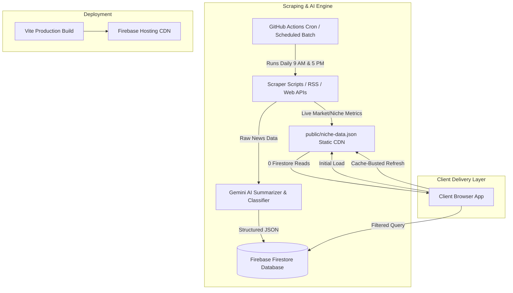

# 🚀 Universal Automated News Slate Framework Blueprint
> **A Replicable, Zero-Backend, Fully Automated White-Label Platform for Niche Intelligence Portals (AI, Fitness, Finance, Tech, Real Estate, Health)**

---

## 📑 Executive Overview & Architecture

The **Universal Automated News Slate Framework** is designed to deliver a high-impact, real-time news portal for any vertical (Finance, AI, Fitness, Healthcare, Tech) with **zero server infrastructure costs** and **minimal database read quota consumption**.



---

## 🏛️ Core Architectural Principles

1. **Static CDN First (0 Database Quota Read Pattern)**:
   - High-frequency widgets (Ticker, Sector Heatmap, Live Statistics) fetch from a static `/niche-data.json` file hosted directly on Firebase Hosting CDN.
   - **Result**: Unlimited live client refreshes cost **0 Firestore Read Quota**.

2. **Automated AI Curation Pipeline**:
   - Multi-source HTML/RSS scraper extracts articles.
   - **Google Gemini API** (`@google/genai` or `@google/generative-ai`) summarizes key takeaways in 3 concise bullet points, auto-assigns niche category tags, and calculates impact weightage (**High**, **Medium**, **Standard**).

3. **Fully Serverless & Autonomous**:
   - **GitHub Actions** workflows run headless node scripts twice daily.
   - Automatically commits updated static JSON to GitHub and deploys updated hosting builds to **Firebase Hosting**.

---

## 🛠️ Step-by-Step Blueprint for Replicating a New Niche Slate

### Phase 1: Firebase Project Setup
1. Go to [Firebase Console](https://console.firebase.google.com/) and create a new project (e.g., `ai-news-slate` or `fitness-news-slate`).
2. **Enable Cloud Firestore**:
   - Mode: Production mode.
   - Location: Choose your primary region (e.g., `asia-south1` or `us-central1`).
   - Create Collection: `articles`.
3. **Enable Firebase Hosting**:
   - Run `npm install -g firebase-tools`
   - Run `firebase login`
   - Run `firebase init hosting` inside project folder.
4. Set `.firebaserc`:
   ```json
   {
     "projects": {
       "default": "YOUR_NEW_FIREBASE_PROJECT_ID"
     }
   }
   ```

---

### Phase 2: Niche Adaptation & Content Schema

#### 1. Define Categories & Impact Metrics for Your Domain:

| Vertical | Categories | Key Live Widgets | Example Sources |
|---|---|---|---|
| **AI & Tech** | LLMs, Vision & Robotics, AI Ethics, Developer Tools, Startups | Model Benchmark Heatmap, GPU Cloud Pricing | ArXiv, TechCrunch, HuggingFace, OpenAI Blog |
| **Fitness & Health** | Hypertrophy, Nutrition, Biohacking, Supplements, Cardio | Daily Macro/Calorie Estimator, Workout Trends | PubMed, Men's Health, Bodybuilding.com, Examine |
| **Finance & Mutual Funds** | Equities, Mutual Funds, PMS/AIF, Insurance, Bonds | 5-Day FII/DII Chart, Sector Heatmap, RBI Calendar | Economic Times, Moneycontrol, Google Finance |
| **Real Estate** | Commercial, Residential, REITs, Urban Infra, PropTech | City Rental Yield Tracker, Circle Rates | Housing.com, Economic Times Property, PropTiger |

#### 2. Standardized Article Firestore Schema:

```typescript
interface Article {
  id: string;                    // SHA-256 or MD5 hash of title
  title: string;                 // Concise Headline
  summary: string[];             // Array of 3 key takeaways
  category: string;              // Domain Category (e.g. "LLMs" or "Nutrition")
  impactLevel: "High" | "Medium" | "Standard"; 
  tags: string[];                // Keywords
  source: string;                // Publisher Name
  sourceUrl: string;             // Direct Article Link
  imageUrl?: string;             // Cover Image
  publishedDate: string;         // ISO timestamp or "06 Aug 2026"
  curatedDate: string;           // YYYY-MM-DD
  createdAt: FirebaseTimestamp;
}
```

---

### Phase 3: Automated Scraper & AI Curation Engine

Create `scripts/curate-news.cjs`:

```javascript
const fs = require('fs');
const { GoogleGenerativeAI } = require('@google/generative-ai');
const admin = require('firebase-admin');

// Initialize Firebase Admin
const serviceAccount = JSON.parse(process.env.FIREBASE_SERVICE_ACCOUNT_KEY);
admin.initializeApp({
  credential: admin.credential.cert(serviceAccount)
});
const db = admin.firestore();

// Initialize Gemini AI
const genAI = new GoogleGenerativeAI(process.env.GEMINI_API_KEY);

async function curateNicheNews() {
  console.log('🤖 Starting AI Curation Engine...');

  // 1. Scrape raw news from RSS or Web Endpoints
  const rawArticles = await fetchRawRSSOrHtml(); 

  const model = genAI.getGenerativeModel({ model: 'gemini-1.5-flash' });

  for (const item of rawArticles) {
    const prompt = `
      You are an expert news editor for an executive audience.
      Summarize the following article in 3 short, high-impact bullet points.
      Categorize it under one of: [Category A, Category B, Category C].
      Assign impact: High, Medium, or Standard.

      Title: ${item.title}
      Content: ${item.content}

      Return JSON format:
      {
        "summary": ["bullet 1", "bullet 2", "bullet 3"],
        "category": "Category A",
        "impactLevel": "High",
        "tags": ["tag1", "tag2"]
      }
    `;

    const result = await model.generateContent(prompt);
    const text = result.response.text();
    const parsed = JSON.parse(text.replace(/```json|```/g, '').trim());

    // 2. Save to Firestore
    const docId = Buffer.from(item.title).toString('hex').slice(0, 20);
    await db.collection('articles').doc(docId).set({
      title: item.title,
      summary: parsed.summary,
      category: parsed.category,
      impactLevel: parsed.impactLevel,
      tags: parsed.tags,
      source: item.source,
      sourceUrl: item.link,
      curatedDate: new Date().toISOString().split('T')[0],
      createdAt: admin.firestore.FieldValue.serverTimestamp()
    }, { merge: true });
  }

  console.log('✅ AI Curation Complete!');
}
```

---

### Phase 4: Live Data Scraper (Static CDN Feed)

Create `scripts/fetch-niche-data.cjs`:

```javascript
const fs = require('fs');
const path = require('path');

async function fetchLiveNicheMetrics() {
  console.log('⚡ Fetching Live Niche Metrics...');

  // Scrape public financial/AI/fitness APIs or Yahoo Finance
  const tickerData = [
    { symbol: 'GPT-4o', val: '128k ctx', change: '+20%', isUp: true },
    { symbol: 'CLAUDE 3.5', val: '200k ctx', change: '+15%', isUp: true }
  ];

  const payload = {
    ticker: tickerData,
    updatedAt: new Date().toISOString()
  };

  fs.writeFileSync(
    path.join(__dirname, '../public/niche-data.json'),
    JSON.stringify(payload, null, 2)
  );

  console.log('Saved to public/niche-data.json!');
}

fetchLiveNicheMetrics();
```

---

### Phase 5: GitHub Actions Automated Workflow

Create `.github/workflows/curate.yml`:

```yaml
name: 🔄 Daily AI Curation & Deployment Pipeline

on:
  schedule:
    # 9:03 AM IST (03:33 UTC) and 5:33 PM IST (12:03 UTC)
    - cron: '33 3 * * *'
    - cron: '3 12 * * *'
  workflow_dispatch:

jobs:
  curate-and-deploy:
    runs-on: ubuntu-latest
    steps:
      - name: Checkout Code
        uses: actions/checkout@v3

      - name: Setup Node.js
        uses: actions/setup-node@v3
        with:
          node-version: 18

      - name: Install Dependencies
        run: npm ci

      - name: Run Live Data Scraper
        run: node scripts/fetch-niche-data.cjs

      - name: Run Gemini AI Curation Pipeline
        env:
          GEMINI_API_KEY: ${{ secrets.GEMINI_API_KEY }}
          FIREBASE_SERVICE_ACCOUNT_KEY: ${{ secrets.FIREBASE_SERVICE_ACCOUNT_KEY }}
        run: node scripts/curate-news.cjs

      - name: Build Web Application
        run: npm run build

      - name: Deploy to Firebase Hosting
        uses: FirebaseExtended/action-hosting-deploy@v0
        with:
          repoToken: '${{ secrets.GITHUB_TOKEN }}'
          firebaseServiceAccount: '${{ secrets.FIREBASE_SERVICE_ACCOUNT }}'
          channelId: live
          projectId: YOUR_NEW_FIREBASE_PROJECT_ID
```

---

## 🎨 UI Component Architecture & Design System

### 1. Key Component Hierarchy:
- **`Header.jsx`**: Brand Logo, Customer Advisory Badge, Theme Toggle, Bookmarks Counter.
- **`MarketTicker.jsx` / `NicheTicker.jsx`**: Scrolling continuous marquee bar backed by `/niche-data.json`.
- **`SectorHeatmap.jsx` / `NicheHeatmap.jsx`**: 8-tile interactive grid with client-side live refresh button (`Refresh Live 🔄`).
- **`Highlights.jsx`**: Top 3 High-Impact hero banner cards.
- **`CategoryFilter.jsx` & `ImpactFilter.jsx`**: Dynamic category pills with item count badges.
- **`ArticleModal.jsx`**: Full-screen reader drawer with social sharing & bookmarking.

---

## 🔑 Deployment & Checklist for New Customers

To instantiate a new portal for a client in **under 30 minutes**:

1. **Fork/Clone Directory**:
   `git clone https://github.com/YOUR_ORG/niche-news-slate-template.git my-client-slate`
2. **Update Environment Variables (`.env`)**:
   ```env
   VITE_FIREBASE_API_KEY=AIzaSy...
   VITE_FIREBASE_PROJECT_ID=my-client-slate
   ```
3. **Configure Secrets in GitHub Repo**:
   - Go to `Settings` -> `Secrets and variables` -> `Actions`.
   - Add `GEMINI_API_KEY`, `FIREBASE_SERVICE_ACCOUNT`, `FIREBASE_SERVICE_ACCOUNT_KEY`.
4. **Deploy Initial Build**:
   ```bash
   npm run build
   firebase deploy --only hosting
   ```

---

> [!TIP]
> **Zero-Quota Maintenance Note**:
> Always keep live tickers and heatmaps fetching from `public/niche-data.json` instead of Firestore. Firestore should strictly store curated long-form articles. This ensures 100,000+ daily page views cost **$0 in database charges**.
