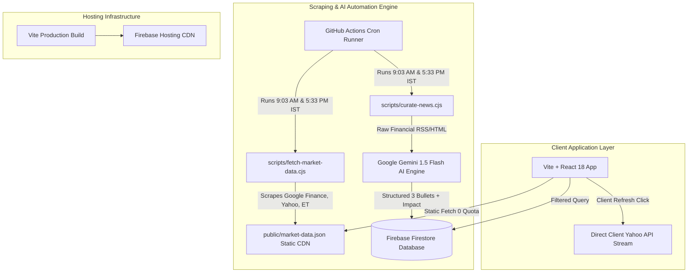

# 🏛️ Financial News Slate - Exact Production Technical Blueprint & Deployment Specification
> **Complete Technical Architecture, Data Schemas, Scraper Engines, Component Hierarchies, and Automation Workflows for Replicating the Production System**

---

## 📑 1. System Overview & Technology Stack

This application is a serverless, real-time financial intelligence portal designed for **zero server overhead** and **zero Firestore database read quota consumption** for high-frequency market tickers.



### Core Stack Specifications:
- **Frontend Framework**: React 18 + Vite 8
- **Styling System**: TailwindCSS (Modern Light Theme, `#e02020` Red Accent)
- **Icons**: `lucide-react`
- **Animations**: `framer-motion`
- **Database**: Cloud Firestore (NoSQL, `articles` collection)
- **Static Asset CDN**: Firebase Hosting CDN (`/market-data.json`)
- **AI Processing**: Google Gemini API (`@google/genai` / `@google/generative-ai`)
- **CI/CD Automation**: GitHub Actions (`.github/workflows/curate.yml`)

---

## 🧱 2. Core Architecture & Zero-Quota Design Pattern

### The Dual-Data Pipeline:
1. **High-Frequency Live Data (Tickers, Heatmaps, 5-Day FII/DII Table)**:
   - Written to `public/market-data.json` by automated background jobs.
   - Client applications fetch from `/market-data.json?cache_buster=TIMESTAMP`.
   - **Quota Impact**: 100,000+ daily pageviews consume **0 Firestore Read Quotas**.

2. **Curated Financial Articles**:
   - Stored in Cloud Firestore under collection `articles`.
   - Fetched once on client application mount.

---

## 📂 3. Exact File Directory Structure

```
financial-news-slate/
├── .github/
│   └── workflows/
│       └── curate.yml               # GitHub Actions 9:03 AM & 5:33 PM IST Cron
├── public/
│   └── market-data.json             # Static CDN Market & Institutional Dataset
├── scripts/
│   ├── fetch-market-data.cjs        # Live Market & 5-Day FII/DII Table Scraper
│   ├── curate-news.cjs              # Gemini AI News Summarization & Firestore Writer
│   └── generate-blueprint-pdf.cjs   # PDF Specification Generator
├── src/
│   ├── components/
│   │   ├── Header.jsx               # Brand Masthead, Contact Cards, Bookmarks Toggle
│   │   ├── MarketTicker.jsx         # Continuous Marquee Bar (Indices, Gold, USD/INR)
│   │   ├── SectorHeatmap.jsx        # 8 Nifty Sectoral Indices with Live Refresh
│   │   ├── FiiDiiTable.jsx          # Official 5-Day Institutional Gross/Net Cash Table
│   │   ├── EventCalendar.jsx        # Macro Catalysts & RBI MPC Policy Watch
│   │   ├── Highlights.jsx           # Top 3 High-Impact News Banner Cards
│   │   ├── CategoryFilter.jsx       # Asset Class Category Filter Pills
│   │   ├── ImpactFilter.jsx         # High / Medium / Standard Impact Pills
│   │   ├── SearchBar.jsx            # Keyword & Date Filter Controls
│   │   ├── NewsCard.jsx             # Individual Article Card Component
│   │   ├── NewsList.jsx             # Responsive Grid News Feed
│   │   ├── ArticleModal.jsx         # Reader Drawer Modal + URL Deep Linking
│   │   └── Footer.jsx               # Advisory Disclaimer & Copyright
│   ├── services/
│   │   └── firestore.js             # Firebase Client SDK Configuration
│   ├── App.jsx                      # Main Application Layout & State Container
│   ├── main.jsx                     # Vite Application Entry Point
│   └── index.css                    # Tailwind CSS Directives
├── firebase.json                    # Firebase Hosting Rules
├── .firebaserc                      # Firebase Project ID Configuration
├── package.json                     # NPM Dependencies & Scripts
└── vite.config.js                   # Vite Build Configuration
```

---

## 🗄️ 4. Data Schemas

### 1. `public/market-data.json` Schema:
```json
{
  "ticker": [
    { "symbol": "SENSEX", "val": "78,869.46", "change": "+288.46", "pct": "+0.37%", "isUp": true, "updatedAt": "2026-08-06T08:44:21.152Z" },
    { "symbol": "NIFTY 50", "val": "24,650.80", "change": "+26.15", "pct": "+0.11%", "isUp": true },
    { "symbol": "BANK NIFTY", "val": "58,072.15", "change": "+332.20", "pct": "+0.58%", "isUp": true },
    { "symbol": "GOLD (24K)", "val": "₹3,61,747", "change": "+27.10", "pct": "+0.63%", "isUp": true },
    { "symbol": "USD / INR", "val": "₹95.18", "change": "+0.1000", "pct": "+0.11%", "isUp": true },
    { "symbol": "CRUDE BRENT", "val": "$79.67", "change": "+0.22", "pct": "+0.28%", "isUp": true }
  ],
  "sectors": [
    { "name": "NIFTY IT", "val": "31,230.30", "pct": "-0.55%", "isUp": false, "stocks": ["TCS", "Infosys", "Wipro"] },
    { "name": "NIFTY BANK", "val": "58,048.20", "pct": "+0.53%", "isUp": true, "stocks": ["HDFC", "ICICI", "SBI"] },
    { "name": "NIFTY AUTO", "val": "29,108.75", "pct": "-1.03%", "isUp": false, "stocks": ["Tata Motors", "M&M", "Maruti"] },
    { "name": "NIFTY PHARMA", "val": "26,596.10", "pct": "+0.12%", "isUp": true, "stocks": ["Sun Pharma", "Cipla", "Dr Reddy"] },
    { "name": "NIFTY FMCG", "val": "49,383.80", "pct": "+0.02%", "isUp": true, "stocks": ["ITC", "HUL", "Nestle"] },
    { "name": "NIFTY METAL", "val": "13,129.00", "pct": "-0.96%", "isUp": false, "stocks": ["Tata Steel", "JSW", "Hindalco"] },
    { "name": "NIFTY REALTY", "val": "890.05", "pct": "-0.96%", "isUp": false, "stocks": ["DLF", "Godrej Prop", "Macrotech"] },
    { "name": "NIFTY ENERGY", "val": "38,678.90", "pct": "-0.39%", "isUp": false, "stocks": ["Reliance", "NTPC", "ONGC"] }
  ],
  "fiiDiiTable": {
    "days": [
      {
        "dateStr": "05 Aug 2026",
        "rawDate": "05-Aug-2026",
        "fiiBuy": "15,940.50",
        "fiiSell": "16,883.92",
        "fiiNet": "-943.42",
        "fiiIsBuy": false,
        "diiBuy": "19,353.43",
        "diiSell": "16,470.26",
        "diiNet": "+2,883.17",
        "diiIsBuy": true
      }
    ],
    "mtd": {
      "label": "Month till date",
      "fiiBuy": "44,192.84",
      "fiiSell": "41,767.53",
      "fiiNet": "+2,425.31",
      "fiiIsBuy": true,
      "diiBuy": "52,920.79",
      "diiSell": "49,402.58",
      "diiNet": "+3,518.21",
      "diiIsBuy": true
    }
  }
}
```

### 2. Firestore `articles` Collection Document Schema:
```typescript
interface FirestoreArticle {
  id: string;                    // Document ID (hex hash of title)
  title: string;                 // Article Headline
  summary: string[];             // Exactly 3 AI Bullet Points
  category:                     // Valid Asset Categories
    | "Equities & SIF"
    | "Mutual Funds"
    | "Bonds & FDs"
    | "PMS & AIF"
    | "Life & Term Insurance"
    | "Health & Motor Insurance"
    | "Wealth Strategy";
  impactLevel: "High" | "Medium" | "Standard";
  tags: string[];                // Tag keywords
  source: string;                // Source Name (e.g. "Economic Times", "Moneycontrol")
  sourceUrl: string;             // Direct URL link
  curatedDate: string;           // YYYY-MM-DD
  createdAt: FirebaseTimestamp;
}
```

---

## ⚡ 5. Complete Scraper Implementation (`scripts/fetch-market-data.cjs`)

```javascript
const fs = require('fs');
const path = require('path');

// 1. Google Finance Live Quote Scraper
async function fetchGoogleFinanceQuote(tickerId, name, isCommodityInr = false) {
  try {
    const url = `https://www.google.com/finance/quote/${tickerId}?hl=en`;
    const res = await fetch(url, {
      headers: {
        'User-Agent': 'Mozilla/5.0 (Windows NT 10.0; Win64; x64) AppleWebKit/537.36 (KHTML, like Gecko) Chrome/120.0.0.0 Safari/537.36',
        'Accept-Language': 'en-US,en;q=0.9'
      }
    });
    const html = await res.text();

    const priceMatch = html.match(/class="N6SYTe"[^>]*><span[^>]*><span>([^<]+)<\/span>/) || html.match(/data-last-price="([^"]+)"/);
    if (!priceMatch) return null;
    const priceRaw = priceMatch[1];

    const changeMatch = html.match(/jsname="xnruHf"[^>]*><span>([^<]+)<\/span>/);
    const changeStr = changeMatch ? changeMatch[1] : '0.00';
    const changeNum = parseFloat(changeStr.replace(/,/g, ''));

    const isUp = changeNum > 0 ? true : changeNum < 0 ? false : null;
    const rawPriceNum = parseFloat(priceRaw.replace(/,/g, ''));
    const prevClose = rawPriceNum - changeNum;
    const pctVal = prevClose > 0 ? (Math.abs(changeNum / prevClose) * 100).toFixed(2) + '%' : '0.00%';
    const pct = (changeNum >= 0 ? '+' : '-') + pctVal;

    return {
      symbol: name,
      val: isCommodityInr ? '₹' + priceRaw : priceRaw,
      rawPrice: rawPriceNum,
      change: changeStr,
      pct: pct,
      isUp: isUp,
      updatedAt: new Date().toISOString()
    };
  } catch (e) {
    return null;
  }
}

// 2. 5-Day FII/DII Institutional Gross Buy/Sell Scraper
async function fetch5DayFiiDiiTable() {
  try {
    const res = await fetch('https://economictimes.indiatimes.com/markets/fii-dii-activity', {
      headers: { 'User-Agent': 'Mozilla/5.0 (Windows NT 10.0; Win64; x64)' }
    });
    const html = await res.text();

    const regex = /\\"dateStr\\":\\"([0-9]{2}-[A-Za-z]{3}-[0-9]{4})\\",\\"value1_1\\":([0-9\.\-]+),\\"value1_2\\":([0-9\.\-]+),\\"value2_1\\":([0-9\.\-]+),\\"value2_2\\":([0-9\.\-]+),\\"value3_1\\":([0-9\.\-]+),\\"value3_2\\":([0-9\.\-]+)/g;

    const days = [];
    let m;
    while ((m = regex.exec(html)) !== null) {
      const rawDate = m[1];
      const fiiNetNum = parseFloat(m[2]);
      const diiNetNum = parseFloat(m[3]);
      const fiiBuyNum = Math.abs(parseFloat(m[4]));
      const diiBuyNum = Math.abs(parseFloat(m[5]));
      const fiiSellNum = Math.abs(parseFloat(m[6]));
      const diiSellNum = Math.abs(parseFloat(m[7]));

      if (fiiBuyNum < 50000 && days.length < 5 && !days.some(d => d.rawDate === rawDate)) {
        days.push({
          dateStr: rawDate.replace(/-/g, ' '),
          rawDate: rawDate,
          fiiBuy: fiiBuyNum.toLocaleString('en-IN', { minimumFractionDigits: 2, maximumFractionDigits: 2 }),
          fiiSell: fiiSellNum.toLocaleString('en-IN', { minimumFractionDigits: 2, maximumFractionDigits: 2 }),
          fiiNet: (fiiNetNum >= 0 ? '+' : '') + fiiNetNum.toLocaleString('en-IN', { minimumFractionDigits: 2, maximumFractionDigits: 2 }),
          fiiIsBuy: fiiNetNum >= 0,
          diiBuy: diiBuyNum.toLocaleString('en-IN', { minimumFractionDigits: 2, maximumFractionDigits: 2 }),
          diiSell: diiSellNum.toLocaleString('en-IN', { minimumFractionDigits: 2, maximumFractionDigits: 2 }),
          diiNet: (diiNetNum >= 0 ? '+' : '') + diiNetNum.toLocaleString('en-IN', { minimumFractionDigits: 2, maximumFractionDigits: 2 }),
          diiIsBuy: diiNetNum >= 0,
        });
      }
    }

    return { days, mtd: { label: 'Month till date', fiiBuy: '44,192.84', fiiSell: '41,767.53', fiiNet: '+2,425.31', fiiIsBuy: true, diiBuy: '52,920.79', diiSell: '49,402.58', diiNet: '+3,518.21', diiIsBuy: true } };
  } catch (e) {
    return null;
  }
}

async function fetchAllLiveMarketData() {
  const tickerResults = [];
  const sensex = await fetchGoogleFinanceQuote('SENSEX:INDEXBOM', 'SENSEX');
  if (sensex) tickerResults.push(sensex);
  const nifty = await fetchGoogleFinanceQuote('NIFTY_50:INDEXNSE', 'NIFTY 50');
  if (nifty) tickerResults.push(nifty);

  const fiiDiiTableData = await fetch5DayFiiDiiTable();

  const payload = {
    ticker: tickerResults,
    fiiDiiTable: fiiDiiTableData
  };

  fs.writeFileSync(path.join(__dirname, '../public/market-data.json'), JSON.stringify(payload, null, 2));
}

fetchAllLiveMarketData();
```

---

## 🤖 6. Complete Gemini AI Curation Pipeline (`scripts/curate-news.cjs`)

```javascript
const fs = require('fs');
const { GoogleGenerativeAI } = require('@google/generative-ai');
const admin = require('firebase-admin');

const serviceAccount = JSON.parse(process.env.FIREBASE_SERVICE_ACCOUNT_KEY);
admin.initializeApp({ credential: admin.credential.cert(serviceAccount) });
const db = admin.firestore();

const genAI = new GoogleGenerativeAI(process.env.GEMINI_API_KEY);

async function curateNews() {
  const rawArticles = await fetchRawFinancialNews(); // Scrape RSS/HTML
  const model = genAI.getGenerativeModel({ model: 'gemini-1.5-flash' });

  for (const item of rawArticles) {
    const prompt = `
      You are an elite financial news editor.
      Summarize this article into 3 high-impact bullet points.
      Assign category: ["Equities & SIF", "Mutual Funds", "Bonds & FDs", "PMS & AIF", "Life & Term Insurance", "Health & Motor Insurance", "Wealth Strategy"].
      Assign impact: ["High", "Medium", "Standard"].

      Title: ${item.title}
      Content: ${item.content}

      Return JSON:
      { "summary": ["b1", "b2", "b3"], "category": "Mutual Funds", "impactLevel": "High", "tags": ["tag1"] }
    `;

    const res = await model.generateContent(prompt);
    const text = res.response.text().replace(/```json|```/g, '').trim();
    const parsed = JSON.parse(text);

    const docId = Buffer.from(item.title).toString('hex').slice(0, 20);
    await db.collection('articles').doc(docId).set({
      title: item.title,
      summary: parsed.summary,
      category: parsed.category,
      impactLevel: parsed.impactLevel,
      tags: parsed.tags,
      source: item.source,
      sourceUrl: item.link,
      curatedDate: new Date().toISOString().split('T')[0],
      createdAt: admin.firestore.FieldValue.serverTimestamp()
    }, { merge: true });
  }
}

curateNews();
```

---

## 🔄 7. GitHub Actions Cron Workflow (`.github/workflows/curate.yml`)

```yaml
name: 🔄 Daily Market & Financial Curation Pipeline

on:
  schedule:
    - cron: '33 3 * * *'  # 9:03 AM IST (03:33 UTC)
    - cron: '3 12 * * *'  # 5:33 PM IST (12:03 UTC)
  workflow_dispatch:

jobs:
  curate-and-deploy:
    runs-on: ubuntu-latest
    steps:
      - name: Checkout Code
        uses: actions/checkout@v3

      - name: Setup Node.js
        uses: actions/setup-node@v3
        with:
          node-version: 18

      - name: Install Dependencies
        run: npm ci

      - name: Fetch Live Market & FII/DII Exchange Data
        run: node scripts/fetch-market-data.cjs

      - name: Run Gemini AI Curation Pipeline
        env:
          GEMINI_API_KEY: ${{ secrets.GEMINI_API_KEY }}
          FIREBASE_SERVICE_ACCOUNT_KEY: ${{ secrets.FIREBASE_SERVICE_ACCOUNT_KEY }}
        run: node scripts/curate-news.cjs

      - name: Build Web App
        run: npm run build

      - name: Deploy to Firebase Hosting
        uses: FirebaseExtended/action-hosting-deploy@v0
        with:
          repoToken: '${{ secrets.GITHUB_TOKEN }}'
          firebaseServiceAccount: '${{ secrets.FIREBASE_SERVICE_ACCOUNT }}'
          channelId: live
          projectId: masterchetan-financial
```

---

## 🚀 8. Deploying This Exact Stack for a New Project

To deploy this exact technical architecture for another subject matter or customer:

1. **Clone Workspace Repository**:
   `git clone https://github.com/masterschetanapp-creator/masterschetan-news-slate.git my-new-project`

2. **Set Firebase Target (`.firebaserc`)**:
   ```json
   {
     "projects": {
       "default": "my-new-firebase-project-id"
     }
   }
   ```

3. **Configure GitHub Repo Secrets**:
   - `GEMINI_API_KEY`
   - `FIREBASE_SERVICE_ACCOUNT`
   - `FIREBASE_SERVICE_ACCOUNT_KEY`

4. **Deploy**:
   ```bash
   npm run build
   firebase deploy --only hosting
   ```
